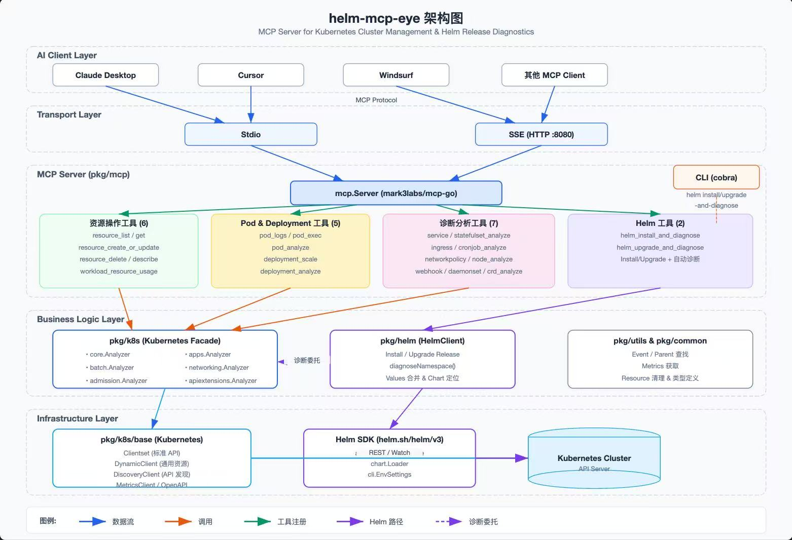

# helm-agent-eye

## 项目简介

helm-agent-eye 是一个基于 MCP (Model Context Protocol) 的 Kubernetes 集群管理和分析工具，专注于 Helm release 的诊断和监控。

### 架构图



主要功能：
- 使用 MCP 协议监控和分析 Kubernetes 集群
- 安装和升级 Helm release 并自动诊断相关 K8s 资源
- 支持 STDIO 服务器和 SSE (Server-Sent Events) 服务器模式
- 提供详细的资源诊断结果和问题汇总

## 技术栈

- Go 语言
- Helm SDK (v3)
- Kubernetes client-go
- Cobra 命令行库
- Viper 配置库

## 安装

### 前提条件

- Go 1.16+
- Helm 3+
- Kubernetes 集群访问权限

### 构建

```bash
go build -o helm-agent-eye main.go
```

## 用法

### 基本命令

```bash
# 显示帮助信息
helm-agent-eye -h

# 显示版本信息
helm-agent-eye --version

# 启动 STDIO 服务器
helm-agent-eye

# 启动 SSE 服务器（默认端口 8080）
helm-agent-eye --sse

# 启动 SSE 服务器并指定端口
helm-agent-eye --sse --port 9090
```

### Helm 命令

#### 安装并诊断

```bash
# 从本地 chart 安装
helm-agent-eye helm install-and-diagnose myapp ./charts/myapp -n myns

# 从仓库安装并设置自定义值
helm-agent-eye helm install-and-diagnose myapp stable/nginx -n myns --set replicas=2

# 安装但不等待资源就绪
helm-agent-eye helm install-and-diagnose myapp ./charts/myapp -n myns --no-wait
```

#### 升级并诊断

```bash
# 使用新版本 chart 升级
helm-agent-eye helm upgrade-and-diagnose myapp stable/nginx -n myns --version 1.2.0

# 升级并重用现有值
helm-agent-eye helm upgrade-and-diagnose myapp ./charts/myapp -n myns --reuse-values

# 升级失败时清理
helm-agent-eye helm upgrade-and-diagnose myapp ./charts/myapp -n myns --cleanup-on-fail
```

## 诊断功能

系统会诊断以下 Kubernetes 资源：

- Pod
- Deployment
- StatefulSet
- Service
- Ingress
- CronJob
- DaemonSet

诊断结果包括资源状态、问题详情和汇总统计。

## 项目结构

```
├── cmd/
│   ├── helm.go          # Helm 相关命令
│   └── root.go          # 根命令和服务器启动
├── pkg/
│   ├── common/          # 通用常量和类型
│   ├── helm/            # Helm 客户端实现
│   ├── k8s/             # Kubernetes 资源分析
│   │   ├── admissionregistration/  # Webhook 分析
│   │   ├── apiextensions/           # CRD 分析
│   │   ├── apps/                    # 应用资源分析
│   │   ├── base/                    # 基础 Kubernetes 功能
│   │   ├── batch/                   # 批处理资源分析
│   │   ├── core/                    # 核心资源分析
│   │   └── networking/              # 网络资源分析
│   ├── mcp/             # MCP 服务器实现
│   └── utils/           # 工具函数
├── main.go              # 项目入口
├── go.mod
└── go.sum
```

## 贡献

欢迎提交 Issue 和 Pull Request 来改进这个项目。

## 许可证

[MIT License](LICENSE)
